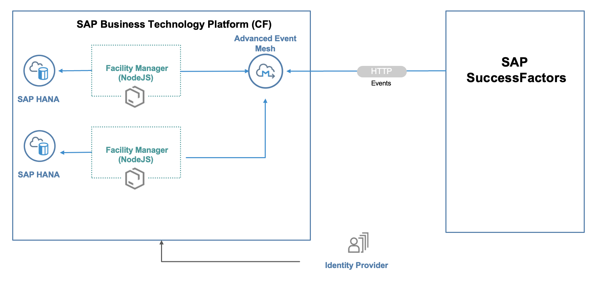

# Create Facility Manager Application Consuming Business Events from SAP SuccessFactors and SAP Advanced Event Mesh

## Description

Extend SAP SuccessFactors on the SAP Business Technology Platform (SAP BTP) using state-of-the-art methodologies and technologies. Put an event-driven architecture into action, use the [**SAP Integration Suite, Advanced Event Mesh**](https://help.sap.com/docs/SAP_ADVANCED_EVENT_MESH) for consuming on SAP SuccessFactors data events.

The main intent of this scenario is to complement an existing business process in an SAP solution, which means, enhancing SAP SuccessFactors with additional business process steps. This involves adding major logic and/or additional data and goes beyond simple UI changes.

## Business Scenario

John, Facility manager of ACME corporation would like to get notification when employee location is transferred by the company to his region (e.g Bribane, AUS). John would then proceed with the employee on-boarding process by allocating workstation and other relevant accessories (Lockers, Desk keys …).

**Current Position - What is the challenge?**

- Employee data available only in SAP SuccessFactors system.
- Facility manager need access to SAP SuccessFactors for their work.
- No custom UI for specific workstation allocation use case.

**Destination - What is the outcome?**

- Changes in SAP SuccessFactors communicated via events in real time to extension application
- Custom extension application works independently from SuccessFactors
- Facility Manager only need access to custom app

## Solution Architecture

The extension application is developed using the Express NodeJS and runs on the SAP BTP. It consumes platform services like SAP Integration Suite, Advanced Event Mesh and SAP HANA services. The events generated in SAP SuccessFactors are inserted into an SAP Advanced Event Mesh queue created by NodeJs app (Facility Manager). The application consumes these events and inserts relevant employee details into the local database.

## Focus Topics

The tutorial focuses on the following aspects:

- Building a side-by-side extension to [SAP SuccessFactors](https://help.sap.com/docs/SAP_SUCCESSFACTORS_HXM_SUITE)
- Setting up eventing and consuming events from SAP SuccessFactors using [SAP Advanced Event Mesh](https://help.sap.com/docs/SAP_ADVANCED_EVENT_MESH)
- Developing an application on [SAP BTP](https://help.sap.com/viewer/product/BTP/Cloud/en-US?task=discover_task) 
- Implementing an [SAP Fiori UI](https://help.sap.com/docs/SAPUI5)

## Where to Start ?

#### Step 1: [Prerequisites](./documentation/Prerequisites/README.md)

#### Step 2: [Set Up Advanced Event Mesh](./documentation/setup-advanced-event-mesh/README.md)

#### Step 3: [Set Up Events in SAP SuccessFactors](./documentation/setup-events-successfactors/README.md)

#### Step 4: [Set Up Facility Manager Application](./documentation/setup-facility-manager-app/README.md)

#### Step 5: [Execute Example Scenario](./documentation/execute-example-scenario/README.md)

## Known Issues

The tutorial is provided on the "as-is" basis. Currently, there are no known issues for the tutorial project.

## How to Obtain Support

Create an issue to get support or to report a bug in [GitHub](https://github.com/SAP-samples/issues).

## License

Copyright (c) 2022 SAP SE or an SAP affiliate company. All rights reserved. This project is licensed under the Apache Software License, version 2.0 except as noted otherwise in the [LICENSE](LICENSES/Apache-2.0.txt) file.

